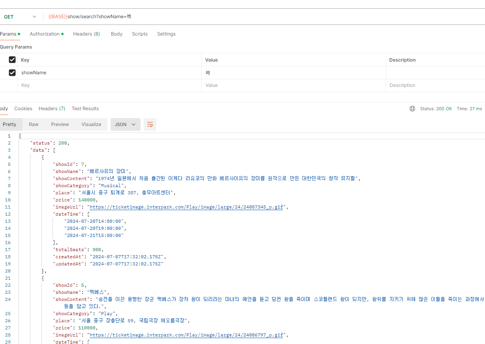

# TICKET ZONE

사용자가 원하는 공연을 예매할 수 있는 웹 사이트

## 프로젝트 내용

1. 회원 가입 기능을 통해 유저를 생성할 수 있다.
   
2. 로그인 시 Access Token을 발급하여 사용자 인증이 가능하다.
   
3. Access Token을 이용하여 사용자 정보를 조회할 수 있다.
   
4. 사용자 권한을 확인하여 공연 등록을 할 수 있다. (Admin만 가능)
   
5. 공연을 전체 목록, id별, 카테고리별, 공연명 별로 조회할 수 있다.

- 전체 목록 조회
  
- 공연 ID별 조회
  
- 카테고리별 조회
  
- 공연명 별 조회
  

6. 좌석을 지정하지 않고, 공연 예매를 할 수 있다.
   
7. 사용자별 공연 예매 내역을 조회할 수 있다.
   

## Framework Used

```bash
###NestJS
###TypeORM
###TypeScript
```

## Environment Variables

'.env.example' 파일의 이름을 '.env' 로 변경하고 아래 내용을 채움

```bash
DB_USERNAME= DB 사용자 이름
DB_PASSWORD= DB 비밀번호
DB_HOST= DB 호스트 주소
DB_PORT= DB 포트 번호
DB_NAME= DB 이름
DB_SYNC= DB 스키마 동기화할지 여부를 결정 (true OR false)
JWT_SECRET_KEY=JWT 생성을 위한 비밀키
```

## Installation

```bash
$ npm install
```

## Running the app

```bash
# development
$ npm run start

# watch mode
$ npm run start:dev

# production mode
$ npm run start:prod
```

## Test

```bash
# unit tests
$ npm run test

# e2e tests
$ npm run test:e2e

# test coverage
$ npm run test:cov
```

## API 명세서

[https://melted-gram-487.notion.site/Node-js-API-0f815b0b37164189b3bd8f7ed2ef1086](https://melted-gram-487.notion.site/Node-js-API-ce047bb2f9b84ee887c5f0e66f17c39f?pvs=74)

## ERD

https://drawsql.app/teams/soobeen/diagrams/-3

## 프로젝트 배포

https://www.soobeen.shop/
